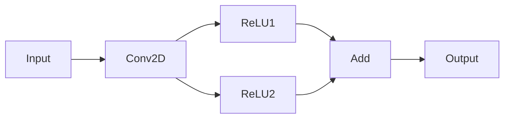
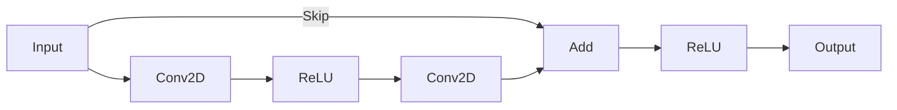
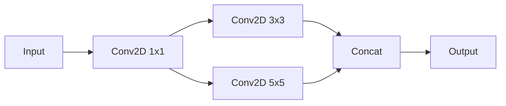

# Dominator-Based Operator Fusion

## Overview

Dominator-based operator fusion is an advanced optimization technique that identifies and fuses operations in "diamond patterns" - where multiple consumers converge to a single output. This approach extends beyond simple chain fusion (handled by `PatternFusionPass`) to handle more complex graph structures commonly found in modern neural networks.

### Why Dominator-Based Fusion Matters

Traditional fusion passes typically handle simple chains like `Conv -> ReLU -> Add`. However, many neural network architectures contain more complex patterns:

- **Residual connections** in ResNet-style architectures
- **Multi-branch computations** where separate operations merge
- **Diamond patterns** with parallel intermediate operations

Dominator-based fusion uses **post-dominator analysis** to identify when operations can be safely fused despite having multiple paths through the graph. This analysis ensures that:
- Fused operations execute together on all execution paths
- Memory accesses are minimized (fewer intermediate buffers)
- Performance is improved through kernel fusion

### TVM Inspiration

This implementation follows TVM's dominator-based fusion strategy, which classifies operators into pattern kinds and uses post-dominator relationships to determine safe fusion boundaries.

## Diamond Pattern Examples

### Basic Diamond Pattern

The most common diamond pattern involves a computation that splits into multiple branches and then converges:



In this example:
- `Conv2D` produces a tensor that is consumed by both `ReLU1` and `ReLU2`
- Both `ReLU` operations feed into `Add`
- The `Add` operation **post-dominates** all other operations (all paths must go through it)

With dominator-based fusion, all operations can be fused into a single kernel because `Add` post-dominates the entire diamond.

### Residual Connection Pattern

ResNet-style architectures use skip connections that create diamond patterns:



Here, the `Add` operation post-dominates both the main branch and the skip connection, allowing the entire residual block to be fused.

### Multi-Branch Pattern

Some architectures use parallel branches that merge:



The `Concat` operation post-dominates both branches, enabling fusion of the parallel convolution paths.

## How It Works

### Post-Dominator Analysis

A node **post-dominates** another node if all paths from the source node to the graph exit must pass through the post-dominating node. The implementation computes this using:

1. **Graph Reversal**: Post-dominance is computed as dominance on the reversed graph
2. **Virtual Exit Node**: A virtual exit node connects all graph outputs
3. **NetworkX Algorithm**: Uses NetworkX's `immediate_dominators()` for efficient computation

From `/home/ayd/code/nnc-py/src/nnc_py/passes/dominator_tree.py`:

```python
# Step 3: Reverse the graph for post-dominance computation
nx_graph_reversed = nx_graph.reverse()

# Step 4: Compute immediate dominators using the virtual exit as start
idom = nx.immediate_dominators(nx_graph_reversed, exit_node)
```

### Two-Phase Fusion Strategy

The `DominatorFusionPass` executes in two phases:

#### Phase 0: kOutEWiseFusable -> kElemWise

Fuses reduction-like operations (Conv2D, MatMul) with element-wise operations:

```python
# From /home/ayd/code/nnc-py/src/nnc_py/passes/dominator_fusion.py
for node in output_ewise_nodes:
    dominators = self.dominator_tree.get_post_dominator_chain(node.name)
    # Try to fuse with dominator if safe
```

#### Phase 1: kElemWise/kInjective -> kBroadcast

Fuses element-wise and injective operations into broadcast operations:

```python
for node in elemwise_nodes:
    dominators = self.dominator_tree.get_post_dominator_chain(node.name)
    # Fuse with broadcast dominator if safe
```

### Path Validation

Before fusing, the pass validates that:
- The fused depth does not exceed `max_fuse_depth` (default: 256)
- The number of function arguments does not exceed `max_function_args` (default: 256)
- Path constraints are satisfied (using `PathValidator`)

From `/home/ayd/code/nnc-py/src/nnc_py/passes/path_validator.py`:

```python
def check_path(self, src: NodeEntry, dst: NodeEntry,
               max_kind: OpPatternKind) -> bool:
    """Validate all paths from src to dst satisfy pattern constraint."""
    paths = self._find_all_paths(src, dst)
    for path in paths:
        for node_entry in path:
            if node_entry.pattern.value > max_kind.value:
                return False
    return True
```

## Fusion Rules Table

Operators are classified into pattern kinds that determine fusion compatibility:

| Pattern Kind | Value | Description | Operators |
|--------------|-------|-------------|-----------|
| `kOutEWiseFusable` | 4 | Reduction-like ops that can fuse with element-wise | `Conv2D`, `MatMul`, `GEMM` |
| `kElemWise` | 1 | Element-wise operations | `ReLU`, `Sigmoid`, `Add`, `Mul`, `Sub`, `Div`, `Sqrt`, `Exp`, `Log` |
| `kBroadcast` | 2 | Broadcasting operations | `BatchNorm`, `LayerNorm`, `Softmax`, `Concat` |
| `kInjective` | 3 | Shape manipulation (injective mapping) | `Reshape`, `Flatten`, `Transpose`, `Squeeze`, `Unsqueeze` |
| `kOpaque` | 0 | Cannot be fused | `MaxPool`, `AvgPool`, `ReduceMean`, `ReduceSum`, `LSTM` |

### Fusion Compatibility

The combination of pattern kinds follows TVM's strategy:

```python
# From /home/ayd/code/nnc-py/src/nnc_py/ir/op_pattern.py
def combine_pattern_kind(p1: OpPatternKind, p2: OpPatternKind) -> OpPatternKind:
    # Opaque blocks everything
    if p1 == OpPatternKind.kOpaque or p2 == OpPatternKind.kOpaque:
        return OpPatternKind.kOpaque

    # kOutEWiseFusable propagates
    if p1 == OpPatternKind.kOutEWiseFusable or p2 == OpPatternKind.kOutEWiseFusable:
        return OpPatternKind.kOutEWiseFusable

    # Otherwise, take the maximum (more restrictive pattern)
    return OpPatternKind(max(p1, p2))
```

### Valid Fusion Patterns

| Consumer Pattern | Can Fuse With Producer Pattern |
|------------------|--------------------------------|
| `kElemWise` | `kOutEWiseFusable`, `kElemWise`, `kBroadcast` |
| `kBroadcast` | `kElemWise`, `kInjective`, `kBroadcast` |
| `kInjective` | `kElemWise`, `kInjective` |
| `kOutEWiseFusable` | `kOutEWiseFusable` |
| `kOpaque` | Cannot fuse with any |

## Usage

### Enabling Dominator Fusion

Dominator-based fusion is enabled at **O3 optimization level**:

```python
from nnc_py.ir.context import CompileContext
from nnc_py.passes.base import PassManager

# Create compile context with graph
ctx = CompileContext(graph=graph, target="x86")

# Run passes with O3 optimization
passes = PassManager.get_passes_for_opt_level(opt_level=3)
for pass_obj in passes:
    pass_obj.run(ctx)
```

### Command-Line Usage

```bash
# Compile with O3 to enable dominator-based fusion
python -m nnc_py compile model.onnx --output model.c --opt-level O3
```

### API Usage

```python
from nnc_py.passes.dominator_fusion import DominatorFusionPass

# Create and run the pass directly
fusion_pass = DominatorFusionPass(
    max_fuse_depth=256,      # Maximum depth of fused operations
    max_function_args=256    # Maximum arguments in fused functions
)
result = fusion_pass.run(ctx)
```

### Test Examples

See `/home/ayd/code/nnc-py/tests/test_dominator_fusion_pass.py` for working examples:

```python
# Diamond pattern test
def test_diamond_pattern_fusion():
    """Test fusion of a diamond pattern: conv -> [relu1, relu2] -> add"""
    graph = Graph()
    conv = Node(op_type=OpType.CONV2D, name="conv1", ...)
    relu1 = Node(op_type=OpType.RELU, name="relu1", ...)
    relu2 = Node(op_type=OpType.RELU, name="relu2", ...)
    add = Node(op_type=OpType.ADD, name="add1", ...)
    # ... run DominatorFusionPass ...
```

## Implementation Details

### Key Components

| Component | File | Description |
|-----------|------|-------------|
| `DominatorFusionPass` | `/home/ayd/code/nnc-py/src/nnc_py/passes/dominator_fusion.py` | Main fusion pass |
| `DominatorTree` | `/home/ayd/code/nnc-py/src/nnc_py/passes/dominator_tree.py` | Post-dominator tree computation |
| `PathValidator` | `/home/ayd/code/nnc-py/src/nnc_py/passes/path_validator.py` | Path validation for safe fusion |
| `EnhancedGroupArena` | `/home/ayd/code/nnc-py/src/nnc_py/passes/fusion_groups_enhanced.py` | Fusion group management |
| `OpPatternKind` | `/home/ayd/code/nnc-py/src/nnc_py/ir/op_pattern.py` | Operator pattern classification |

### Integration with Pass Pipeline

From `/home/ayd/code/nnc-py/src/nnc_py/passes/base.py`:

```python
# O3: Advanced optimizations
if opt_level >= 3:
    return [
        IdentityEliminationPass(),
        DeadCodeEliminationPass(),
        PatternFusionPass(),      # Pattern-based fusion (chains)
        DominatorFusionPass(),    # Dominator-based fusion (diamonds)
        LivenessAnalysisPass(),
        MemoryPlanningPassV2(),
        SpillAnalysisPass(),
    ]
```

The `DominatorFusionPass` runs **after** `PatternFusionPass`, allowing it to handle more complex patterns that remain after simple chain fusion.

### Configuration Parameters

| Parameter | Default | Description |
|-----------|---------|-------------|
| `max_fuse_depth` | 256 | Maximum depth of operations to fuse together |
| `max_function_args` | 256 | Maximum number of input arguments for a fused function |

## References

- TVM: "Dominator Tree" and "Operator Fusion" documentation
- `/home/ayd/code/nnc-py/tests/test_dominator_tree.py` - Post-dominator tree tests
- `/home/ayd/code/nnc-py/tests/test_dominator_fusion_pass.py` - Fusion pass tests
- `/home/ayd/code/nnc-py/tests/test_dominator_fusion_codegen.py` - Code generation tests
